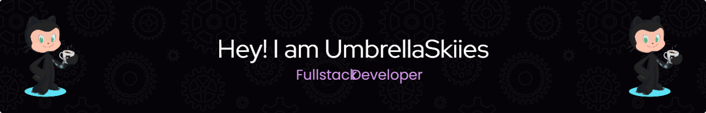

<!---

---

--->

# 👋 Hi, I'm Neo Thomas Titebe

### Full-Stack Developer • Backend Engineer • Software Builder

I build practical software, APIs, and web applications with a focus on **clean architecture, problem solving, and continuous learning**.

  

  
  

---

## 👨‍💻 About Me

I'm a **Full-Stack Developer and Software Engineer** who enjoys turning ideas and business requirements into working software.

My development journey started through self-learning and has grown into building production-oriented applications, REST APIs, backend services, databases, and modern web applications.

I enjoy working across the stack, but I'm particularly interested in **backend engineering, API development, system architecture, and building reliable software systems**.

  

* 🎓 Diploma in Information Technology — **2022**
* 💻 Full-Stack Developer / Software Engineer
* 🔧 Interested in **backend engineering, APIs, distributed systems & architecture**
* 🌱 Continuously learning and improving my engineering skills
* 🤝 Open to collaboration, interesting projects and learning opportunities
* 📚 I enjoy understanding **how systems work**, not just how to use them
* 📈 Outside of programming, I enjoy **forex trading and photography**
* ⚡ I believe good software is built through **curiosity, discipline and continuous iteration**

---

## 🛠️ Technology Stack

### Languages

  
  
  
  
  
  

### Backend

  
  
  
  
  

### Frontend

  
  
  
  

### Databases

  
  
  
  

### Tools & Platforms

  
  
  
  
  
  
  

---

## 🔨 What I Build

I'm interested in building software across several areas:

* 🌐 **Web Applications**
* 🔌 **RESTful APIs**
* 🏗️ **Backend Services**
* 🗄️ **Database-driven Applications**
* 🔐 **Authentication & Security**
* 📄 **Document & Data Management Systems**
* 💳 **Financial & Business Applications**
* ⚙️ **Enterprise Software**
* 📊 **Data-driven Systems**
* 🧩 **Modular & Scalable Architectures**

---

## 🚀 Personal Projects

### ⛓️ Blockforge — Dark SaaS Blockchain

A futuristic SaaS platform concept exploring **blockchain technology, decentralized data, blockchain APIs, and smart-contract integration** through a modern dark-themed interface.

Built as a personal project to explore modern frontend technologies while designing an experience around emerging blockchain applications.

**Technologies:** Astro • React • TypeScript • Tailwind CSS • Framer Motion

🔗 [View Project](https://github.com/NeoDev99/dark-saas-blockchain)

---

### 💡 More Projects Coming Soon

I'm continuously building personal projects to experiment with new technologies, solve problems, and turn ideas into working software.

---

## 📊 GitHub Stats

 

---

## 🏆 GitHub Trophies

---

## 🌐 Let's Connect

  
  
  

📧 **Email:** [thomasneo946@gmail.com](mailto:thomasneo946@gmail.com)

---

## 💡 A Little More About Me

> **"Understand the system. Build the system. Improve the system."**

I'm fascinated by how complex systems work — from software architecture and financial systems to the processes behind everyday technology.

When I'm not coding, you'll probably find me studying **forex markets**, working on personal projects, taking photographs, or exploring something new in technology.

---

## 💬 Favourite Quote

> **"Why do programmers prefer dark mode? Because light attracts bugs."** 🐛

---

### 🚀 Always Learning • Always Building • Always Improving

**Thanks for visiting my profile!**

<!---
UmbrellaSkiies/UmbrellaSkiies is a ✨ special ✨ repository because its `README.md` (this file) appears on your GitHub profile.
You can click the Preview link to take a look at your changes.
--->
