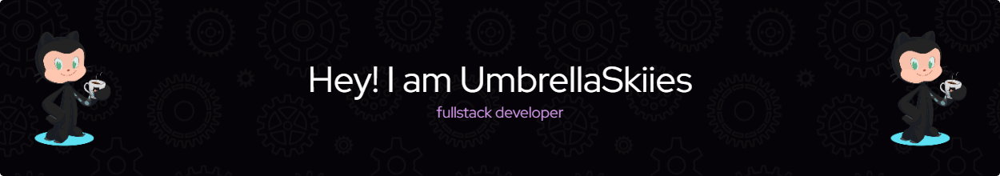

<!---

--->

<h1 align="center">Hi 👋, I'm Neo Thomas Titebe</h1>
<h3 align="center">A Full-Stack Web Developer</h3>

  

  

As a Full Stack Web Developer, I want to work on a team that solves problems creatively. I can pick up new technology rapidly and put them to use. Ruby on Rails, HTML5, CSS3, Javascript, jQuery, PHP, and WordPress are among my areas of expertise. Four years ago, I self-taught these abilities.

## About Me

- 👀 I’m interested in learning everything there is to learn about Technology.
- 👨‍🎓 I completed my Diploma in Information Technology (IT) in 2022
- 👯 I’m looking to collaborate on any project for learning purposes.
- 🔭 I’m currently working on [Image_Gallery](https://github.com/NeoDev99/Image_Gallery)
- 🌱 I’m currently learning **MERN (MongoDB, Express.js, React, and Node.js) Stack**
- 🥅 2024 Goals: Contribute & collaborate on more projects.
- ⚡ Fun fact: I love to trade forex and take photos/pictures in my spare time.
- 📫 How to reach me **thomasneo946@gmail.com**

#### Connect with me:

## Technologies:

  
  
  
  

  
  
  
  

  
  
  
  

## Database:

  
  

## Tools:

  
  
  
  
  
  
  
   
  

## Stats:

&nbsp;

<!---
UmbrellaSkiies/UmbrellaSkiies is a ✨ special ✨ repository because its `README.md` (this file) appears on your GitHub profile.
You can click the Preview link to take a look at your changes.
--->
